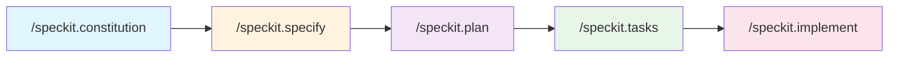
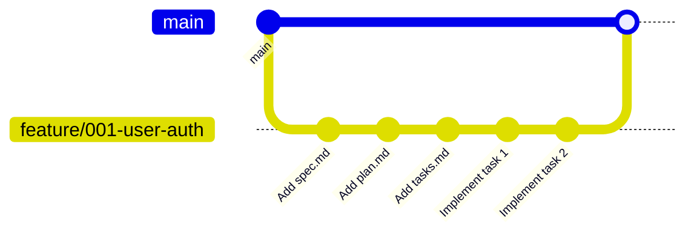
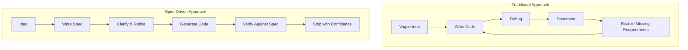

# GitHub SpecKit: A Complete Beginner's Guide

> **What is SpecKit?** GitHub's open-source toolkit for **Spec-Driven Development (SDD)** — a methodology that puts specifications at the center of AI-assisted coding.

---

## Table of Contents
- [Why SpecKit Exists](#why-speckit-exists)
- [Core Concepts](#core-concepts)
- [Installation & Setup](#installation--setup)
- [The Workflow (4 Phases)](#the-workflow-4-phases)
- [Git Branch Integration](#git-branch-integration)
- [Cheat Sheet](#-cheat-sheet)
- [Best Practices](#best-practices)
- [Common Pitfalls & Tricky Parts](#common-pitfalls--tricky-parts)
- [Tips & Tricks from the Community](#tips--tricks-from-the-community)
- [The Theory Behind Specifications](#the-theory-behind-specifications)

---

## Why SpecKit Exists

SpecKit transforms "vibe coding" (ad-hoc prompting) into a **systematic, repeatable process**. It bridges the gap between human intent and AI execution.

### The Problem It Solves
| Without SpecKit | With SpecKit |
|-----------------|--------------|
| Vague prompts → inconsistent code | Structured specs → predictable output |
| Context loss between sessions | Persistent specifications as source of truth |
| AI interprets requirements differently each time | Clear acceptance criteria for validation |
| "Works but not what I wanted" | "Exactly as specified" |

---

## Core Concepts

### 📜 Constitution (`constitution.md`)
Your project's **immutable principles** — the non-negotiable rules that guide all development.

```markdown
# Project Constitution

## Core Principles
- All code must be type-hinted
- Test-first development approach
- No external API calls without explicit configuration
- CLI-first application architecture

## Tech Stack
- Language: Python 3.11+
- CLI Framework: Typer
- Testing: pytest
```

### 📋 Specification (`spec.md`)
Defines **WHAT** to build — user stories, acceptance criteria, edge cases. No technical details.

### 🏗️ Plan (`plan.md`)
Defines **HOW** to build it — architecture, file structure, implementation approach.

### ✅ Tasks (`tasks.md`)
Granular, actionable items the AI can execute one by one.

---

## Installation & Setup

### Prerequisites
- **Node.js** v18+
- **Git** installed and configured
- An AI coding assistant (GitHub Copilot, Claude Code, Gemini CLI)

### Install the CLI
```bash
# Using npm
npm install -g @anthropic/specify

# Using uv (Python ecosystem)
uv tool install specify
```

### Initialize a Project
```bash
# New project
specify init my-project
cd my-project

# Existing project (run from project root)
specify init .
```

This creates:
```
your-project/
├── .specify/
│   ├── memory/
│   │   └── constitution.md      # Your project principles
│   └── templates/               # Prompt templates
├── .github/
│   └── copilot-instructions.md  # AI agent context
└── spec/
    └── (specs will appear here)
```

---

## The Workflow (4 Phases)



### Phase 0: Constitution (One-Time Setup)
```
/speckit.constitution
```
**Purpose:** Establish project-wide principles that NEVER change.

**Prompt Example:**
> "This is a TypeScript CLI tool using Commander.js. All code must have JSDoc comments. Use Vitest for testing. Follow functional programming patterns."

### Phase 1: Specify (The "What")
```
/speckit.specify
```
**Purpose:** Define what you want to build without technical details.

**Good Example:**
> "Build a user authentication system. Users should be able to sign up with email, log in, reset their password, and maintain sessions for 7 days."

**Bad Example (too technical):**
> "Create a JWT auth system using bcrypt with Redis session caching..." ← Save this for the Plan phase!

**Output:** `spec.md` with user stories, acceptance criteria, edge cases.

### Phase 2: Plan (The "How")
```
/speckit.plan
```
**Purpose:** Transform specs into technical blueprints.

**Provide:**
- Tech stack decisions
- Architecture preferences
- Framework choices
- Database structure

**Output:** `plan.md` with file structure, component breakdown, API design.

### Phase 3: Tasks (The "Execute")
```
/speckit.tasks
```
**Purpose:** Break the plan into atomic, implementable tasks.

**Output:** `tasks.md` with numbered, sequential steps like:
```markdown
1. [ ] Create user model schema
2. [ ] Implement password hashing utility
3. [ ] Build signup endpoint
4. [ ] Add email validation
...
```

### Phase 4: Implement
```
/speckit.implement
```
**Purpose:** Execute tasks one by one with AI assistance.

> [!TIP]
> Work on one task at a time. Verify each before moving on.

---

## Git Branch Integration

### Automatic Branch Creation
When you run `/speckit.specify`, SpecKit **automatically creates a new Git branch** to isolate your work.



### Branch Naming Convention
- Feature specs: `feature/spec-<name>` or `feature/001-<description>`
- Hotfix specs: `hotfix/spec-<name>`

### Key Git Commands with SpecKit

```bash
# Check which branch you're on
git branch --show-current

# See all spec-related branches
git branch | grep spec

# After implementing, merge back
git checkout main
git merge feature/spec-user-auth

# If you need to switch specs mid-work
git stash
git checkout feature/spec-other-feature
```

> [!WARNING]
> **Tricky Behavior:** The `/speckit.specify` command may reset your branch from `main` even if you're on a different branch. If you want specs based on a feature branch, check the branch after the command runs.

---

## 📋 Cheat Sheet

### Commands Reference

| Command | Phase | Purpose | Creates |
|---------|-------|---------|---------|
| `/speckit.constitution` | Setup | Define project principles | `constitution.md` |
| `/speckit.specify` | 1 | Define WHAT to build | `spec.md` + new branch |
| `/speckit.plan` | 2 | Define HOW to build | `plan.md` |
| `/speckit.tasks` | 3 | Create task list | `tasks.md` |
| `/speckit.implement` | 4 | Execute tasks | Code files |

### Quick Start Flow
```bash
# 1. Initialize project
specify init .

# 2. In your AI assistant:
/speckit.constitution   # First time only
/speckit.specify        # Start new feature
/speckit.plan           # Create technical plan
/speckit.tasks          # Generate task list
/speckit.implement      # Build it!
```

### File Locations
```
.specify/
├── memory/
│   └── constitution.md    # Project DNA
└── templates/             # Prompt templates

spec/
├── <feature-name>/
│   ├── spec.md           # Requirements
│   ├── plan.md           # Architecture
│   └── tasks.md          # Action items
```

### What to Include in Each Phase

| Phase | ✅ Include | ❌ Avoid |
|-------|-----------|----------|
| **Constitution** | Team principles, quality standards, org requirements | Specific features, detailed tech stack |
| **Specify** | User stories, acceptance criteria, edge cases, business logic | Implementation details, file structures |
| **Plan** | Tech stack, architecture, file structure, API design | Business requirements (already in spec) |
| **Tasks** | Atomic steps, clear dependencies, test requirements | Vague multi-step items |

---

## Best Practices

### 1. Start with Strong Principles
```markdown
# Good constitution.md example
## Core Principles
- Every function must have a docstring
- No magic numbers — use named constants
- Handle all error cases explicitly
- Write tests before implementation (TDD)
```

### 2. Iterate Specifications Before Planning
Don't rush to `/speckit.plan`. Spend time refining your spec:
- Ask "What edge cases am I missing?"
- Define clear acceptance criteria
- Consider error scenarios

### 3. Keep Specs Feature-Focused
```
✅ Good: "User authentication with email login"
❌ Bad:  "Build the entire MVP"
```

### 4. Treat Specs as Living Documents
Update specs when requirements change. Don't let them become stale.

### 5. Review AI Output at Every Phase
The AI might miss context or requirements. Verify before moving to the next phase.

### 6. One Task at a Time
When implementing:
1. Complete task 1 → Test → Commit
2. Complete task 2 → Test → Commit
3. Repeat...

### 7. Use Test-Driven Development
```markdown
# In tasks.md
1. [ ] Write failing test for user signup
2. [ ] Implement signup to pass test
3. [ ] Write failing test for email validation
4. [ ] Implement validation to pass test
```

---

## Common Pitfalls & Tricky Parts

### ⚠️ Pitfall 1: Too Much Detail Too Early
**Problem:** Including tech stack in the Specify phase.
```
❌ "Create a React component using useState and useEffect that..."
✅ "Users should see their cart update in real-time when adding items"
```

### ⚠️ Pitfall 2: Overkill for Small Tasks
**Problem:** Using SpecKit for trivial changes.
```
❌ Using SpecKit to rename a variable
✅ Use SpecKit when building features with multiple files/components
```

### ⚠️ Pitfall 3: Skipping Human Review
**Problem:** Blindly accepting AI-generated specs, plans, or code.
```
✅ Always review generated content before proceeding
✅ Verify the AI understood your requirements
```

### ⚠️ Pitfall 4: Error Amplification
**Problem:** Small mistakes in specs cascade into bigger problems in plans and tasks.
```
✅ Take extra time in the Specify phase
✅ If you find an error late, go back and fix the spec
```

### ⚠️ Pitfall 5: Ignoring Existing Codebases
**Problem:** SpecKit doesn't automatically understand your current code structure.
```
✅ Provide context about existing files and patterns
✅ Reference specific files when creating plans
```

### Tricky Commands

| What Happens | Why | Workaround |
|--------------|-----|------------|
| Branch created from `main` even when you're on another branch | Default behavior | Check branch after `/speckit.specify`, manually create branch first |
| Empty implementation plan generated | Model context issues | Provide more detailed spec, try different AI model |
| Generated code doesn't fit codebase style | Missing constitution rules | Add specific coding standards to constitution |

---

## Tips & Tricks from the Community

### 💡 Tip 1: Front-Load Context
Before starting, provide comprehensive background to the AI:
```
"This is a Node.js project using Express. We have an existing 
User model in src/models/user.js. Authentication uses JWT tokens 
stored in HTTP-only cookies..."
```

### 💡 Tip 2: Use Clarifying Questions
When the AI generates specs, ask:
- "What edge cases might I be missing?"
- "Are there security considerations I should add?"
- "What happens if [X input] is provided?"

### 💡 Tip 3: Model Matters
Different AI models produce different quality results:
- **Claude:** Strong at nuanced requirements
- **GPT-4:** Good at structured outputs
- **Gemini:** Good at technical planning

Try different models if output quality is lacking.

### 💡 Tip 4: Version Your Specs
Commit after each phase:
```bash
git add spec/
git commit -m "spec: Add user auth specification"
# ... after planning ...
git commit -m "spec: Add user auth plan"
```

### 💡 Tip 5: Small, Focused Specs
```
✅ "Add password reset functionality"
✅ "Implement email verification"
❌ "Build complete user management system" (too broad)
```

### 💡 Tip 6: Debug with Isolation
If `/speckit.implement` produces bugs:
1. Work on one task at a time
2. Test immediately after each task
3. Commit working code before moving on

### 💡 Tip 7: Use Constitution for Patterns
Add patterns you want enforced everywhere:
```markdown
## Error Handling Pattern
- All async functions must have try/catch
- Errors should be logged with context
- User-facing errors should be friendly messages
```

---

## The Theory Behind Specifications

### Why Specs Matter: The Fundamental Principle

> "The absence of technical specifications is the single biggest unnecessary risk in software projects."
> — Joel Spolsky (Creator of Trello, Stack Overflow)

### Specification-Driven Development (SDD)

SDD is a paradigm shift from **"code first, document later"** to **"spec first, code later"**:



### Benefits of Spec-First Development

| Benefit | How It Helps |
|---------|--------------|
| **Reduced Bugs** | Issues caught before code is written |
| **Faster Development** | Clear direction = less rework |
| **Better AI Output** | AI has explicit context and constraints |
| **Team Alignment** | Everyone agrees on what "done" means |
| **Living Documentation** | Specs stay current with code |
| **Risk Mitigation** | Problems identified early, when they're cheap to fix |

### The Separation of Concerns

```
┌─────────────────────────────────────────────────────────┐
│  WHAT (Specification)                                   │
│  • User stories: "As a user, I want to..."              │
│  • Acceptance criteria: "It is complete when..."        │
│  • Edge cases: "When X happens, the system should..."   │
└─────────────────────────────────────────────────────────┘
                           ↓
┌─────────────────────────────────────────────────────────┐
│  HOW (Implementation Plan)                              │
│  • Architecture: "We'll use a microservice..."          │
│  • Tech stack: "React frontend, Node backend..."        │
│  • File structure: "Components in src/components/..."   │
└─────────────────────────────────────────────────────────┘
                           ↓
┌─────────────────────────────────────────────────────────┐
│  EXECUTION (Tasks + Code)                               │
│  • Atomic tasks: "Create user model schema"             │
│  • Tests: "Verify signup with valid email"              │
│  • Code: Actual implementation files                    │
└─────────────────────────────────────────────────────────┘
```

### Why This Matters for AI-Assisted Development

AI models work best with:
1. **Clear, explicit instructions** (not vague prompts)
2. **Persistent context** (specs are always available)
3. **Defined success criteria** (acceptance tests)
4. **Constraints and guardrails** (constitution principles)

Without specifications, AI-generated code suffers from:
- Inconsistent style and patterns
- Missing edge cases
- Drifting architecture
- "Looks right, doesn't work" syndrome

---

## When NOT to Use SpecKit

SpecKit adds overhead. Skip it for:
- Quick bug fixes
- Renaming/refactoring
- Single-file changes
- Exploratory coding / prototypes
- Trivial features

**Use SpecKit for:**
- Multi-file features
- Complex business logic
- Team collaboration
- Features requiring clear acceptance criteria
- Anything where "getting it right the first time" matters

---

## Resources & Further Reading

- **Official GitHub SpecKit Repository:** [github.com/anthropics/speckit](https://github.com/anthropics/speckit)
- **Martin Fowler on Specifications:** [martinfowler.com](https://martinfowler.com)
- **The GitHub Blog on SDD:** Search "spec-driven development github blog"

---

## Quick Reference Card

```
╔═══════════════════════════════════════════════════════════════╗
║                    SPECKIT QUICK REFERENCE                     ║
╠═══════════════════════════════════════════════════════════════╣
║  SETUP:        specify init .                                  ║
║  PRINCIPLES:   /speckit.constitution                           ║
║  DEFINE WHAT:  /speckit.specify                                ║
║  DEFINE HOW:   /speckit.plan                                   ║
║  TASK LIST:    /speckit.tasks                                  ║
║  BUILD IT:     /speckit.implement                              ║
╠═══════════════════════════════════════════════════════════════╣
║  REMEMBER:                                                     ║
║  • Constitution = principles (what NEVER changes)              ║
║  • Specify = WHAT to build (user perspective)                  ║
║  • Plan = HOW to build (technical details)                     ║
║  • Tasks = step-by-step execution list                         ║
║  • Implement = AI executes tasks one by one                    ║
╠═══════════════════════════════════════════════════════════════╣
║  GOLDEN RULES:                                                 ║
║  1. Review AI output at every phase                            ║
║  2. One task at a time when implementing                       ║
║  3. Commit often, test always                                  ║
║  4. Treat specs as living documents                            ║
╚═══════════════════════════════════════════════════════════════╝
```

---

*Last updated: January 2026*
