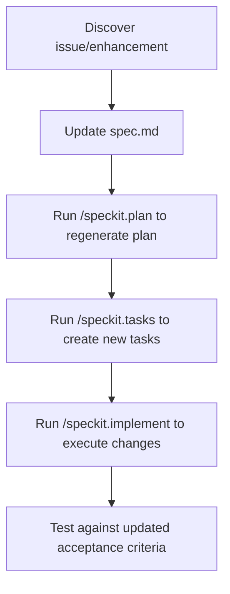

# GitHub SpecKit: A Complete Beginner's Guide

> **What is SpecKit?** GitHub's open-source toolkit for **Spec-Driven Development (SDD)** — a methodology that puts specifications at the center of AI-assisted coding.

---

## Table of Contents
- [Why SpecKit Exists](#why-speckit-exists)
- [Core Concepts](#core-concepts)
- [Installation & Setup](#installation--setup)
- [The Workflow (4 Phases)](#the-workflow-4-phases)
- [Git Branch Integration](#git-branch-integration)
- [Cheat Sheet](#-cheat-sheet)
- [Best Practices](#best-practices)
- [Common Pitfalls & Tricky Parts](#common-pitfalls--tricky-parts)
- [Tips & Tricks from the Community](#tips--tricks-from-the-community)
- [The Theory Behind Specifications](#the-theory-behind-specifications)

---

## Why SpecKit Exists

SpecKit transforms "vibe coding" (ad-hoc prompting) into a **systematic, repeatable process**. It bridges the gap between human intent and AI execution.

### The Problem It Solves
| Without SpecKit | With SpecKit |
|-----------------|--------------|
| Vague prompts → inconsistent code | Structured specs → predictable output |
| Context loss between sessions | Persistent specifications as source of truth |
| AI interprets requirements differently each time | Clear acceptance criteria for validation |
| "Works but not what I wanted" | "Exactly as specified" |

---

## Core Concepts

### 📜 Constitution (`constitution.md`)
Your project's **immutable principles** — the non-negotiable rules that guide all development.

```markdown
# Project Constitution

## Core Principles
- All code must be type-hinted
- Test-first development approach
- No external API calls without explicit configuration
- CLI-first application architecture

## Tech Stack
- Language: Python 3.11+
- CLI Framework: Typer
- Testing: pytest
```

### 📋 Specification (`spec.md`)
Defines **WHAT** to build — user stories, acceptance criteria, edge cases. No technical details.

### 🏗️ Plan (`plan.md`)
Defines **HOW** to build it — architecture, file structure, implementation approach.

### ✅ Tasks (`tasks.md`)
Granular, actionable items the AI can execute one by one.

---

## Installation & Setup

### Prerequisites
- **Node.js** v18+
- **Git** installed and configured
- An AI coding assistant (GitHub Copilot, Claude Code, Gemini CLI)

### Install the CLI
```bash
# Using npm
npm install -g @anthropic/specify

# Using uv (Python ecosystem)
uv tool install specify
```

### Initialize a Project
```bash
# New project
specify init my-project
cd my-project

# Existing project (run from project root)
specify init .
```

This creates:
```
your-project/
├── .specify/
│   ├── memory/
│   │   └── constitution.md      # Your project principles
│   └── templates/               # Prompt templates
├── .github/
│   └── copilot-instructions.md  # AI agent context
└── spec/
    └── (specs will appear here)
```

---

## The Workflow (4 Phases)


### Phase 0: Constitution (One-Time Setup)
```
/speckit.constitution
```
**Purpose:** Establish project-wide principles that NEVER change.

**Prompt Example:**
> "This is a TypeScript CLI tool using Commander.js. All code must have JSDoc comments. Use Vitest for testing. Follow functional programming patterns."

### Phase 1: Specify (The "What")
```
/speckit.specify
```
**Purpose:** Define what you want to build without technical details.

**Good Example:**
> "Build a user authentication system. Users should be able to sign up with email, log in, reset their password, and maintain sessions for 7 days."

**Bad Example (too technical):**
> "Create a JWT auth system using bcrypt with Redis session caching..." ← Save this for the Plan phase!

**Output:** `spec.md` with user stories, acceptance criteria, edge cases.

### Phase 2: Plan (The "How")
```
/speckit.plan
```
**Purpose:** Transform specs into technical blueprints.

**Provide:**
- Tech stack decisions
- Architecture preferences
- Framework choices
- Database structure

**Output:** `plan.md` with file structure, component breakdown, API design.

### Phase 3: Tasks (The "Execute")
```
/speckit.tasks
```
**Purpose:** Break the plan into atomic, implementable tasks.

**Output:** `tasks.md` with numbered, sequential steps like:
```markdown
1. [ ] Create user model schema
2. [ ] Implement password hashing utility
3. [ ] Build signup endpoint
4. [ ] Add email validation
...
```

### Phase 4: Implement
```
/speckit.implement
```
**Purpose:** Execute tasks one by one with AI assistance.

> [!TIP]
> Work on one task at a time. Verify each before moving on.

---

## Git Branch Integration

### Automatic Branch Creation
When you run `/speckit.specify`, SpecKit **automatically creates a new Git branch** to isolate your work.


### Branch Naming Convention
- Feature specs: `feature/spec-<name>` or `feature/001-<description>`
- Hotfix specs: `hotfix/spec-<name>`

### Key Git Commands with SpecKit

```bash
# Check which branch you're on
git branch --show-current

# See all spec-related branches
git branch | grep spec

# After implementing, merge back
git checkout main
git merge feature/spec-user-auth

# If you need to switch specs mid-work
git stash
git checkout feature/spec-other-feature
```

> [!WARNING]
> **Tricky Behavior:** The `/speckit.specify` command may reset your branch from `main` even if you're on a different branch. If you want specs based on a feature branch, check the branch after the command runs.

---

## 📋 Cheat Sheet

### Commands Reference

| Command | Phase | Purpose | Creates |
|---------|-------|---------|---------|
| `/speckit.constitution` | Setup | Define project principles | `constitution.md` |
| `/speckit.specify` | 1 | Define WHAT to build | `spec.md` + new branch |
| `/speckit.plan` | 2 | Define HOW to build | `plan.md` |
| `/speckit.tasks` | 3 | Create task list | `tasks.md` |
| `/speckit.implement` | 4 | Execute tasks | Code files |

### Quick Start Flow
```bash
# 1. Initialize project
specify init .

# 2. In your AI assistant:
/speckit.constitution   # First time only
/speckit.specify        # Start new feature
/speckit.plan           # Create technical plan
/speckit.tasks          # Generate task list
/speckit.implement      # Build it!
```

### File Locations
```
.specify/
├── memory/
│   └── constitution.md    # Project DNA
└── templates/             # Prompt templates

spec/
├── <feature-name>/
│   ├── spec.md           # Requirements
│   ├── plan.md           # Architecture
│   └── tasks.md          # Action items
```

### What to Include in Each Phase

| Phase | ✅ Include | ❌ Avoid |
|-------|-----------|----------|
| **Constitution** | Team principles, quality standards, org requirements | Specific features, detailed tech stack |
| **Specify** | User stories, acceptance criteria, edge cases, business logic | Implementation details, file structures |
| **Plan** | Tech stack, architecture, file structure, API design | Business requirements (already in spec) |
| **Tasks** | Atomic steps, clear dependencies, test requirements | Vague multi-step items |

---

## Best Practices

### 1. Start with Strong Principles
```markdown
# Good constitution.md example
## Core Principles
- Every function must have a docstring
- No magic numbers — use named constants
- Handle all error cases explicitly
- Write tests before implementation (TDD)
```

### 2. Iterate Specifications Before Planning
Don't rush to `/speckit.plan`. Spend time refining your spec:
- Ask "What edge cases am I missing?"
- Define clear acceptance criteria
- Consider error scenarios

### 3. Keep Specs Feature-Focused
```
✅ Good: "User authentication with email login"
❌ Bad:  "Build the entire MVP"
```

### 4. Treat Specs as Living Documents
Update specs when requirements change. Don't let them become stale.

### 5. Review AI Output at Every Phase
The AI might miss context or requirements. Verify before moving to the next phase.

### 6. One Task at a Time
When implementing:
1. Complete task 1 → Test → Commit
2. Complete task 2 → Test → Commit
3. Repeat...

### 7. Use Test-Driven Development
```markdown
# In tasks.md
1. [ ] Write failing test for user signup
2. [ ] Implement signup to pass test
3. [ ] Write failing test for email validation
4. [ ] Implement validation to pass test
```

---

## Common Pitfalls & Tricky Parts

### ⚠️ Pitfall 1: Too Much Detail Too Early
**Problem:** Including tech stack in the Specify phase.
```
❌ "Create a React component using useState and useEffect that..."
✅ "Users should see their cart update in real-time when adding items"
```

### ⚠️ Pitfall 2: Overkill for Small Tasks
**Problem:** Using SpecKit for trivial changes.
```
❌ Using SpecKit to rename a variable
✅ Use SpecKit when building features with multiple files/components
```

### ⚠️ Pitfall 3: Skipping Human Review
**Problem:** Blindly accepting AI-generated specs, plans, or code.
```
✅ Always review generated content before proceeding
✅ Verify the AI understood your requirements
```

### ⚠️ Pitfall 4: Error Amplification
**Problem:** Small mistakes in specs cascade into bigger problems in plans and tasks.
```
✅ Take extra time in the Specify phase
✅ If you find an error late, go back and fix the spec
```

### ⚠️ Pitfall 5: Ignoring Existing Codebases
**Problem:** SpecKit doesn't automatically understand your current code structure.
```
✅ Provide context about existing files and patterns
✅ Reference specific files when creating plans
```

### Tricky Commands

| What Happens | Why | Workaround |
|--------------|-----|------------|
| Branch created from `main` even when you're on another branch | Default behavior | Check branch after `/speckit.specify`, manually create branch first |
| Empty implementation plan generated | Model context issues | Provide more detailed spec, try different AI model |
| Generated code doesn't fit codebase style | Missing constitution rules | Add specific coding standards to constitution |

---

## Tips & Tricks from the Community

### 💡 Tip 1: Front-Load Context
Before starting, provide comprehensive background to the AI:
```
"This is a Node.js project using Express. We have an existing 
User model in src/models/user.js. Authentication uses JWT tokens 
stored in HTTP-only cookies..."
```

### 💡 Tip 2: Use Clarifying Questions
When the AI generates specs, ask:
- "What edge cases might I be missing?"
- "Are there security considerations I should add?"
- "What happens if [X input] is provided?"

### 💡 Tip 3: Model Matters
Different AI models produce different quality results:
- **Claude:** Strong at nuanced requirements
- **GPT-4:** Good at structured outputs
- **Gemini:** Good at technical planning

Try different models if output quality is lacking.

### 💡 Tip 4: Version Your Specs
Commit after each phase:
```bash
git add spec/
git commit -m "spec: Add user auth specification"
# ... after planning ...
git commit -m "spec: Add user auth plan"
```

### 💡 Tip 5: Small, Focused Specs
```
✅ "Add password reset functionality"
✅ "Implement email verification"
❌ "Build complete user management system" (too broad)
```

### 💡 Tip 6: Debug with Isolation
If `/speckit.implement` produces bugs:
1. Work on one task at a time
2. Test immediately after each task
3. Commit working code before moving on

### 💡 Tip 7: Use Constitution for Patterns
Add patterns you want enforced everywhere:
```markdown
## Error Handling Pattern
- All async functions must have try/catch
- Errors should be logged with context
- User-facing errors should be friendly messages
```

---

## The Theory Behind Specifications

### Why Specs Matter: The Fundamental Principle

> "The absence of technical specifications is the single biggest unnecessary risk in software projects."
> — Joel Spolsky (Creator of Trello, Stack Overflow)

### Specification-Driven Development (SDD)

SDD is a paradigm shift from **"code first, document later"** to **"spec first, code later"**:


### Benefits of Spec-First Development

| Benefit | How It Helps |
|---------|--------------|
| **Reduced Bugs** | Issues caught before code is written |
| **Faster Development** | Clear direction = less rework |
| **Better AI Output** | AI has explicit context and constraints |
| **Team Alignment** | Everyone agrees on what "done" means |
| **Living Documentation** | Specs stay current with code |
| **Risk Mitigation** | Problems identified early, when they're cheap to fix |

### The Separation of Concerns

```
┌─────────────────────────────────────────────────────────┐
│  WHAT (Specification)                                   │
│  • User stories: "As a user, I want to..."              │
│  • Acceptance criteria: "It is complete when..."        │
│  • Edge cases: "When X happens, the system should..."   │
└─────────────────────────────────────────────────────────┘
                           ↓
┌─────────────────────────────────────────────────────────┐
│  HOW (Implementation Plan)                              │
│  • Architecture: "We'll use a microservice..."          │
│  • Tech stack: "React frontend, Node backend..."        │
│  • File structure: "Components in src/components/..."   │
└─────────────────────────────────────────────────────────┘
                           ↓
┌─────────────────────────────────────────────────────────┐
│  EXECUTION (Tasks + Code)                               │
│  • Atomic tasks: "Create user model schema"             │
│  • Tests: "Verify signup with valid email"              │
│  • Code: Actual implementation files                    │
└─────────────────────────────────────────────────────────┘
```

### Why This Matters for AI-Assisted Development

AI models work best with:
1. **Clear, explicit instructions** (not vague prompts)
2. **Persistent context** (specs are always available)
3. **Defined success criteria** (acceptance tests)
4. **Constraints and guardrails** (constitution principles)

Without specifications, AI-generated code suffers from:
- Inconsistent style and patterns
- Missing edge cases
- Drifting architecture
- "Looks right, doesn't work" syndrome

---

## When NOT to Use SpecKit

SpecKit adds overhead. Skip it for:
- Quick bug fixes
- Renaming/refactoring
- Single-file changes
- Exploratory coding / prototypes
- Trivial features

**Use SpecKit for:**
- Multi-file features
- Complex business logic
- Team collaboration
- Features requiring clear acceptance criteria
- Anything where "getting it right the first time" matters

---

## Resources & Further Reading

- **Official GitHub SpecKit Repository:** [github.com/anthropics/speckit](https://github.com/anthropics/speckit)
- **Martin Fowler on Specifications:** [martinfowler.com](https://martinfowler.com)
- **The GitHub Blog on SDD:** Search "spec-driven development github blog"

---

## Quick Reference Card

```
╔═══════════════════════════════════════════════════════════════╗
║                    SPECKIT QUICK REFERENCE                     ║
╠═══════════════════════════════════════════════════════════════╣
║  SETUP:        specify init .                                  ║
║  PRINCIPLES:   /speckit.constitution                           ║
║  DEFINE WHAT:  /speckit.specify                                ║
║  DEFINE HOW:   /speckit.plan                                   ║
║  TASK LIST:    /speckit.tasks                                  ║
║  BUILD IT:     /speckit.implement                              ║
╠═══════════════════════════════════════════════════════════════╣
║  REMEMBER:                                                     ║
║  • Constitution = principles (what NEVER changes)              ║
║  • Specify = WHAT to build (user perspective)                  ║
║  • Plan = HOW to build (technical details)                     ║
║  • Tasks = step-by-step execution list                         ║
║  • Implement = AI executes tasks one by one                    ║
╠═══════════════════════════════════════════════════════════════╣
║  GOLDEN RULES:                                                 ║
║  1. Review AI output at every phase                            ║
║  2. One task at a time when implementing                       ║
║  3. Commit often, test always                                  ║
║  4. Treat specs as living documents                            ║
╚═══════════════════════════════════════════════════════════════╝
```

---

## Practical SpecKit Workflow FAQ

> **This section answers real-world questions about using SpecKit based on the official GitHub documentation and best practices.**

### Why does my spec start with `001-` when I already have other specs?

**Short answer:** The `001-` prefix is per-branch, not a global sequence.

When you run `/speckit.specify`, SpecKit creates a **new Git branch** for your feature. The numbering (`001-`, `002-`, etc.) is assigned when the branch and spec are created, typically based on:
- The order of specs within that branch's lifecycle
- A counter maintained by SpecKit scripts

**What happened in your case:**
- `001-daily-journal-chat` was your first spec/branch
- `002-settings` was your second spec/branch
- `001-ai-model-selection` likely started from a different point or was created in a fresh context

**Recommendation:** Rename spec folders if numbering matters to you, OR accept that numbering is simply a unique identifier. What matters is the descriptive name (`ai-model-selection`), not the number.

---

### Should I create specific or broad specifications?

| Approach | When to Use | Example |
|----------|-------------|---------|
| **Broad specs** | Core features, major systems, initial setup | `001-daily-journal-chat`, `002-settings` |
| **Specific specs** | Enhancements, new capabilities, isolated features | `003-ai-model-selection` |

**The official guidance:**
- **Avoid mega-specs** that try to build everything at once ("Build the entire MVP" ❌)
- **Prefer focused features** ("Add password reset functionality" ✅)
- Each spec should be **independently testable and deliverable**

**Your situation is fine:**
- `001-daily-journal-chat` and `002-settings` are foundational systems (broad)
- `001-ai-model-selection` is a specific enhancement (specific)

This is a valid pattern. You don't need to force everything to be the same size.

---

### Should I add new features to existing specs or create new ones?

**Create a NEW spec when:**
- The feature can be independently developed and tested
- It adds new user-facing functionality
- You want to track it as a separate deliverable
- The change touches many files or introduces new concepts

**Modify an EXISTING spec when:**
- You're fixing bugs in the original implementation
- You're clarifying requirements that were ambiguous
- The change is a direct refinement of the original feature
- It wouldn't make sense as a standalone deliverable

**Example decision for `ai-model-selection`:**
- ✅ **New spec was correct** → It's a distinct feature with its own user stories, acceptance criteria, and implementation
- ❌ Would be wrong to add to `002-settings` → Settings is infrastructure, model selection is functionality

---

### Can I modify a specification after it's "finished"?

**Yes! Specs are living documents.** From the official documentation:

> "Specs become living documents that evolve alongside your code, not dusty artifacts that you write once and forget."

**When to modify completed specs:**
- Requirements changed
- Edge cases were discovered in production
- Better approaches were identified
- Bugs traced back to specification gaps

**Process for modifying:**
1. Check out the spec's branch (or main if merged)
2. Update `spec.md` with changes
3. Use `/speckit.plan` to regenerate the plan
4. Use `/speckit.tasks` to create new tasks
5. Implement the changes

---

### Do new specifications take previous ones into account?

**Not automatically.** Each `/speckit.specify` command works with:
- The `constitution.md` (always included)
- The context you provide in your prompt
- The current codebase (if the AI reads it)

**How to ensure consistency:**
1. **Reference existing specs in your prompt:**
   > "Building on the settings system from `002-settings`, add AI model selection..."

2. **Update your constitution** with learnings from previous specs

3. **Provide explicit context** about how features should integrate

4. **Use `/speckit.clarify`** to ask about interactions with existing features

---

### How can I consolidate or reorganize specifications?

**Option 1: Manual consolidation**
```bash
# Create a new consolidated spec folder
mkdir specs/100-consolidated-features

# Move relevant content
cat specs/001-daily-journal-chat/spec.md > specs/100-consolidated/spec.md
# Manually merge plans and tasks
```

**Option 2: Create a meta-spec**
Create a high-level spec that references and orchestrates other specs:
```markdown
# Feature: Complete Journaling System

This specification consolidates:
- Daily Journal Chat (refs: 001-daily-journal-chat)
- Settings Infrastructure (refs: 002-settings)
- AI Model Selection (refs: 001-ai-model-selection)
```

**Option 3: Archive completed specs**
```bash
# Move completed specs to an archive
mkdir specs/.archive
mv specs/001-daily-journal-chat specs/.archive/
```

---

### How can I reduce context size and token usage?

As your specs grow, token usage can become a concern. Here are strategies:

**1. Prune completed tasks from `tasks.md`**
```markdown
# Instead of keeping 50 completed tasks:
## Completed Tasks Summary
- ✅ All UI components implemented (tasks 1-15)
- ✅ Database integration complete (tasks 16-25)

## Active Tasks
26. [ ] Current work item
27. [ ] Next item
```

**2. Summarize research in `research.md`**
Instead of keeping raw API documentation, keep only conclusions:
```markdown
## Research Summary
- OpenRouter API provides 339+ models
- Endpoint: `/api/v1/models`
- Key fields: `id`, `name`, `pricing`
```

**3. Archive old spec artifacts**
```bash
# Keep only spec.md in active folder, archive the rest
mv specs/001-feature/{plan.md,tasks.md,research.md} specs/.archive/001-feature/
```

**4. Use spec references instead of duplicating**
```markdown
See [Settings Data Model](../002-settings/data-model.md) for schema documentation.
```

**5. Collapse completed specs into constitution**
Major learnings from completed specs can become constitution amendments:
```markdown
# constitution.md
## Amendment 2026-01-18: AI Integration Patterns
Based on 001-ai-model-selection learnings:
- All AI model selections use provider/model-id format
- Fallback models: openai/gpt-4o, anthropic/claude-sonnet-4.5
```

---

### Can I modify old specifications and apply changes to the code?

**Yes, this is the SDD workflow:**



**Example workflow:**
1. User reports: "Model selection doesn't show pricing"
2. **Update `spec.md`:**
   ```markdown
   - **FR-009**: System MUST display pricing information for each model
   ```
3. **Regenerate plan:** `/speckit.plan`
4. **Create tasks:** `/speckit.tasks`
5. **Implement:** `/speckit.implement`

This is called **spec-first bugfixing** — the fix starts at the specification level.

---

### What is the recommended workflow for ongoing development?

**For new features:**
```
/speckit.specify → /speckit.clarify → /speckit.plan → /speckit.tasks → /speckit.implement
```

**For modifications to existing features:**
```
1. Checkout existing spec branch
2. Edit spec.md directly
3. /speckit.plan → /speckit.tasks → /speckit.implement
```

**For bug fixes:**
- **Spec-level bug:** Update spec.md first, then regenerate
- **Code-only bug:** Fix directly, update tasks.md with `[x] Fixed: ...`

**For refactoring:**
- Minor: No spec changes needed
- Major (architectural): Create new spec or update constitution

---

### Summary: Your Spec Organization is Fine

Looking at your current structure:
```
specs/
├── 001-daily-journal-chat/  → Core feature (broad)
├── 002-settings/            → Infrastructure (broad)
└── 001-ai-model-selection/  → Enhancement (specific)
```

**This is a valid organization.** The numbering inconsistency is cosmetic — what matters is that each spec is:
- ✅ Independently testable
- ✅ Has clear acceptance criteria
- ✅ References the constitution
- ✅ Has a complete spec → plan → tasks lifecycle

**Recommendations going forward:**
1. **Number specs sequentially** by manually prefixing: `003-`, `004-`, etc.
2. **Keep specific features separate** (like `ai-model-selection`)
3. **Update constitution** with major learnings
4. **Archive completed specs** to reduce clutter
5. **Reference other specs** instead of duplicating content

---

## External Resources

- **Official GitHub Spec Kit Repository:** [github.com/github/spec-kit](https://github.com/github/spec-kit)
- **Spec-Driven Development Philosophy:** [spec-driven.md](https://github.com/github/spec-kit/blob/main/spec-driven.md)
- **Microsoft DevBlog on Spec Kit:** [Diving Into Spec-Driven Development](https://developer.microsoft.com/blog/spec-driven-development-spec-kit)
- **Video Overview:** [YouTube Guide](https://www.youtube.com/watch?v=a9eR1xsfvHg)

---

*Last updated: January 2026*
